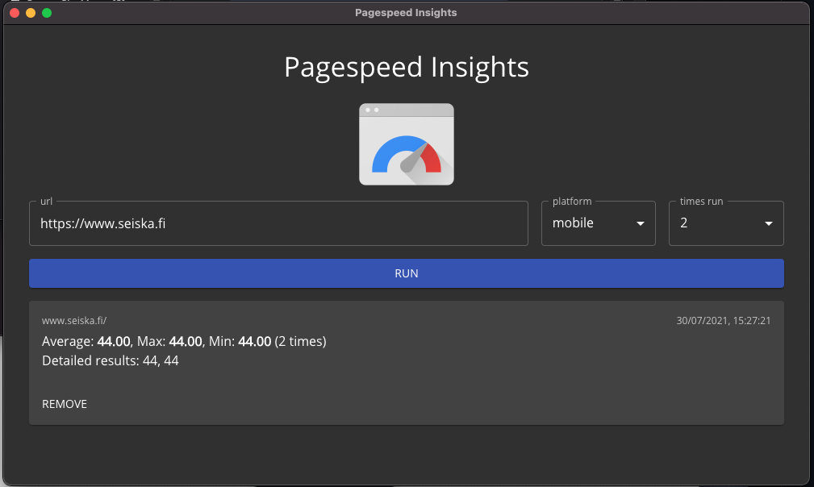

PSI Tool
<p align="center"></p>

## Usage
The app saves your url, platform and times run. It also saves the results.

### Install Dependencies

```

# using yarn or npm
$ yarn (or `npm install`)

```

### Use it

```
# development mode
$ yarn dev (or `npm run dev` or `pnpm run dev`)

# production build
$ yarn build (or `npm run build` or `pnpm run build`)
```
